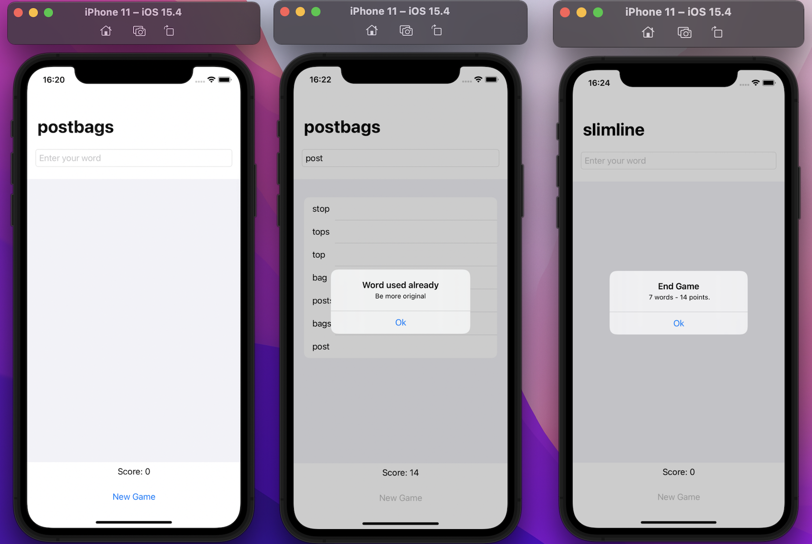

# WordScramble

This is a fun game. The user needs to create a new word with the letters available.

Each new word gives 2 points and the game finish when you decide to start a new game.

Let’s game!

## Project

This project was developed in SwiftUI.

There is a navigationBarTitle that contains the letters to start a game.

There is a navigationView with VStack, and inside it a text field to insert a new word, a list to show all used words, a text to show score of the game and a button to start a new game.

Some functions have been created such as addNewWord, startGame, endGame, isOriginalWord, and more.

I made an alert to appear when the word is not real, original or possible. Each alert show a different message.

**Learning about: SwiftUI, Xcode, NavigationView, List, TextField, Button, Alert, Function, Count, and more.**

*This project was developed during Hacking with SwiftUI course.*
